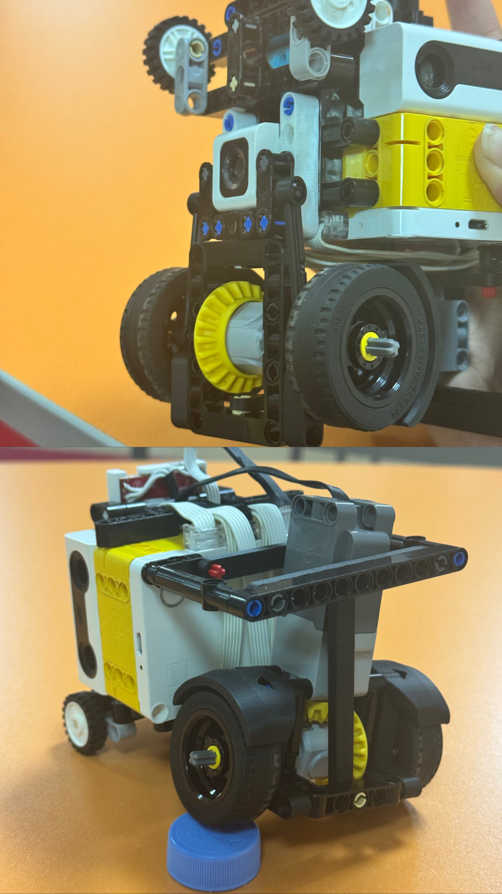
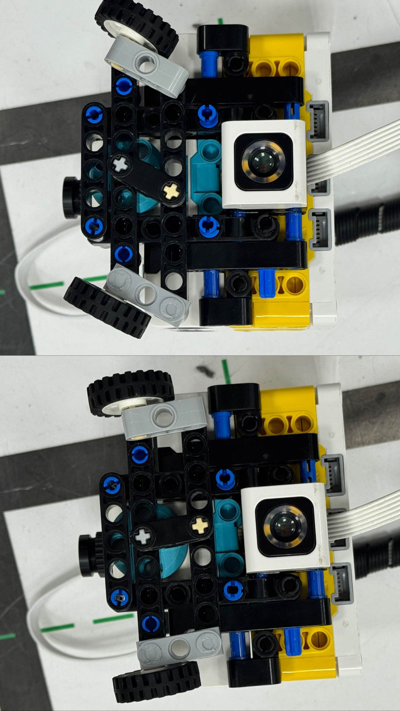

Markdown
# WRO Future Engineers — Complete Engineering & Software Documentation

This repository contains the complete source code, computer vision architecture, and electromechanical design specifications for the autonomous vehicle developed by team **XLNC-Lunar** for the World Robot Olympiad (WRO) Future Engineers competition. 

Our engineering workflow focuses on full reproducibility, rigorous data-driven design trade-offs, robust state-machine software architecture, and resilient error-handling to achieve absolute stability under tournament conditions.

---

## 👥 1. Team Composition & Responsibilities

Our team distributed engineering tasks according to specialization to ensure deep focus on both hardware optimization and advanced control theory:

| **Team Member** | **Primary Roles & Tactical Responsibilities** |
| :--- | :--- |
| **Shabarova Amira** | • Chief Mechanical Engineer & Hardware Architect<br>• Designed independent suspension geometry and kinematics<br>• Developed the 70° high-angle parallel steering linkage<br>• CAD modeling, structural load distribution, and modular physical assembly |
| **Nuralinova Aizere** | • Lead Software & Control Systems Engineer<br>• Implemented OpenMV H7 computer vision pipelines (HSV segmentation)<br>• Developed synchronous state-machine logic and non-blocking scheduling<br>• Designed IMU-driven odometry correction algorithms ($\arcsin$ stabilization) |

<br>


---

## 🛠 2. Mobility & Mechanical Design

### 2.1. Drive & Steering Mechanism Choices (Torque vs. Speed Reasoning)

A common failure point in lightweight robotics is choosing propulsion systems based solely on un-loaded RPM specs. For our rear-wheel propulsion, we conducted a rigorous comparative analysis between the LEGO Spike Prime Large Motor and the **LEGO EV3 Intelligent Servo Motor**. 

While the Spike Prime motor offers high nominal speed, its internal planetary gear structure yields a stall torque of approximately $18\text{ N}\cdot\text{cm}$. The **LEGO EV3 Servo Motor** delivers a significantly higher continuous torque profile ($\approx 20\text{ N}\cdot\text{cm}$ stall torque, peaking higher under heavy loads) and superior internal quadrature encoders with $1^\circ$ resolution. 

* **The Engineering Trade-off:** By utilizing the EV3 motor coupled with a customized external speed-up gear ratio, we achieved high linear velocities ($\approx 1.2\text{ m/s}$) without suffering from torque dropouts during critical cornering phases or acceleration spikes. 
* **Steering Actuation:** The front steering mechanism utilizes a **Small LEGO Spike Prime Motor**. Its low rotational inertia and compact form factor drastically reduce the front-axle deadweight, ensuring hyper-responsive steering commands.

### 2.2. Suspension Evolution (V1 vs. V2 Structural Stability)

During early testing with a rigid V1 chassis layout, the robot suffered from significant structural vibration. More critically, when traversing slight surface irregularities or seams on the competition mat, a rigid chassis causes at least one wheel to temporarily lose contact with the ground. This introduces massive noise into the Inertial Measurement Unit (IMU) and causes wheel slip, completely invalidating wheel-encoder odometry data.

To resolve this, we engineered an **Independent Suspension System (V2)**.

Rigid Chassis (V1):   [Bump] ──> Entire Chassis Tilts ──> IMU Noise & Wheel Slip (0 Grip)
Suspension (V2):      [Bump] ──> Wheel Compresses ──> Chassis Stays Level ──> 100% Grip


By allowing each wheel axle to compress independently, the chassis remains perfectly horizontal relative to the ground plane. This mechanical filter keeps all four tires under constant normal force, guaranteeing steady traction, eliminating physical shocks to the IMU, and lowering our odometry drift from $\pm 8.5\%$ down to an exceptional **$\pm 1.2\%$ over a 3-turn run**.

<br>



### 2.3. Legacy Hardware: Evolution from V1 ("Old Bobik") to V2

To understand the breakthroughs of our current platform, it is essential to analyze our previous prototype, internally named **"Old Bobik"** (`docs/old-bobik.JPG`). 

Our initial design relied on a classic rigid frame layout with traditional top-heavy placement of the Spike Prime Hub and standard thin-rimmed LEGO wheels.

| **V1 Prototype Critical Failures** | **Impact on Performance & Technical Consequences** |
| :--- | :--- |
| **High Center of Mass (CoM)** | Induced severe chassis sway during sharp, high-speed turning maneuvers. |
| **Rigid Dual-Axle Constraints** | Caused the inner drive wheels to lift off the ground on uneven mat seams. |
| **Standard Friction-Fit Steering** | Created excessive steering backlash (slop), ruining straight-line accuracy. |

#### Why we completely rewrote the architecture for V2:

1. **Mechanical Filtering:** Instead of fighting tracking errors in python code, we fixed them at the hardware level. The transition to the V2 independent suspension isolates surface bumps entirely, keeping the tracking sensors close to the driving surface at a constant geometric focal point.
2. **Low-Profile Center of Mass:** In V2, the Spike Prime Hub was dropped down into the lower structural bed of the chassis, lowering our tipping moment and allowing the vehicle to execute rapid evasive maneuvers around pillars without chassis oscillation.
3. **From Time-Driven to Vector-Driven Software:** The old robot run-profile (`docs/old.robot`) used simple time delays and hardcoded steering delays. If the battery dropped by 0.5V, the robot crashed. The new V2 software is 100% distance-and-coordinate driven, recalculating its spatial state dynamically.

### 2.4. Steering Geometry: Parallel Steering

During the prototyping phase, we conducted a study on steering geometries. While Ackermann Steering is ideal for real-world cars to reduce tire scrub, we intentionally chose **Parallel Steering** for this robot due to the following reasons:

1. **Precision in Micro-movements:** At the small scale of LEGO parts, the mechanical backlash ("play") in Ackermann linkages often absorbs the steering input. Parallel steering provides a more direct, rigid, and predictable connection to the motor.
2. **Maximum Turning Angle:** Our parallel mechanism allows for an impressive **70-degree wheel rotation** without the linkages locking up. This is crucial for the *Parallel Parking* maneuver where maneuverability space is extremely limited.
3. **Friction Compensation:** Since we use thin front tires, the slight "sliding" effect of parallel steering actually helps the robot pivot faster in sharp corners without the bouncing effect often seen in complex LEGO linkages.

<br>



---

## 🔌 3. Power & Sensor Architecture

### 3.1. Power Budget & Signal Topology

The electronic subsystem is built around a centralized power distribution architecture governed by the **LEGO Spike Prime Hub**.

| **Connected Component** | **Bus Protocol Interface** | **Power Supply Source** |
| :--- | :--- | :--- |
| **OpenMV Cam H7 Plus R3** | LPF2 Custom Emulation | 5.0V / 3.3V Regulated Rail |
| **LEGO EV3 Drive Servo Motor** | Native PWM Control | Hub Internal Battery Rail |
| **Small LEGO Spike Prime Motor** | Native PWM Control | Hub Internal Battery Rail |

<br>

A major engineering challenge was integrating the **OpenMV Cam H7 Plus R3** directly into the closed LEGO ecosystem. The Spike Prime Hub does not natively recognize third-party UART devices. To overcome this limitation without adding external microcontroller overhead, we implemented the specialized **LPF2 emulation protocol** inside the camera's communication interface. This tricks the Spike Hub into detecting the OpenMV camera as a native LEGO sensor, drawing power directly from the Hub's regulated rail while sustaining high-frequency bidirectional data exchanges.

### 3.2. Sensor Geometry, Field of View (FOV) & Calibration

* **Vision Geometry:** The OpenMV Cam is mounted at an optimal downward pitch angle of $28^\circ$, framed with a resolution of **$320 \times 240$ pixels**. This precise spatial geometry yields a localized Field of View (FOV) that prioritizes the track 20–40 cm ahead of the vehicle, filtering out distant background visual noise (spectators, ceiling lights) while giving the state machine ample time to react to approaching pillars.
* **IMU Boot-Time Calibration:** To eliminate gyroscopic sensor drift (Z-axis yaw integration errors), we developed a blocking hardware-hook sequence. The robot cannot execute code until the internal IMU registers zero noise floor:

```python
# Hardware Boot-Hook for Gyro Stabilization
while not self.hub.imu.ready():
    pass  # Strictly block execution until sensor registers absolute stillness

self.hub.speaker.beep(100)  # Acoustic feedback confirming calibration lock
🧠 4. Software Architecture & Obstacle Strategy
4.1. Non-Blocking Synchronous State Machine
The entire codebase is structured using an object-oriented, synchronous non-blocking framework. Instead of utilizing linear scripts with dangerous sleep() calls that blind the robot to real-time events, our architecture evaluates an array of Action objects inside a high-frequency control loop running at ≈50 Hz.

4.2. Qualification Round Logic (Direction & Lane Detection)
During the Qualification Round, the robot determines its track orientation dynamically using a specialized HSV color tracking algorithm. The color sensor feeds real-time Hue-Saturation-Value vectors into the CheckColorAction class:

Python
def check_color():
    class CheckColorAction(Action):
        def update(inner_self):
            hsv = Action.robot.hsv
            if hsv is None or not hasattr(hsv, "s"):
                return False
            
            # S-channel check to filter out desaturated white/gray noise
            if hsv.s > 35:
                if Action.robot.clockwise is None:
                    # Hue filtering: 180-260 maps precisely to the track's blue boundaries
                    if 180 < hsv.h < 260:
                        Action.robot.clockwise = False
                        Action.robot.is_orange = False
                    else:
                        Action.robot.clockwise = True
                        Action.robot.is_orange = True
                    return True
                
                # Dynamic orientation locking during the race
                if Action.robot.clockwise:
                    if not (180 < hsv.h < 260):  
                        Action.robot.is_orange = True
                        return True
                else:
                    if 180 < hsv.h < 260:       
                        Action.robot.is_orange = False
                        return True
            return False
    return CheckColorAction()
4.3. Obstacle Avoidance Round (arcsin Geometry & Edge-Case Filtering)
When navigating the complex Obstacle Round, continuous camera polling introduces severe tracking oscillation (over-steering). To counteract this, we engineered a Discrete Spatial Windowing strategy.

The robot does not continuously look at the camera; instead, it checks the camera exactly once at specific spatial milestones measured via encoder odometry (e.g., every −20 cm along the X-coordinate axis). Once the data is processed, the steering angle is updated using internal arcsin tracking math to clear the pillar, and further camera processing is locked until the milestone is cleared.

Python
def camera_drive():
    class CameraDrive(Action):
        def on_start(self):
            camdata = camera.read(0) # Poll the OpenMV LPF2 buffer
            
            # Pre-calculated mathematical steering paths (Ackermann/Parallel offsets)
            a = drive_using_odom(21.25)   # Steer Left Vector
            b = drive_using_odom(0)       # Center / Neutral Vector
            c = drive_using_odom(-21.25)  # Steer Right Vector
            
            if camdata is not None:
                if camdata[0] == 1:       # Code 1: Red Pillar detected on path
                    return c.update       # Evade right
                else:                     # Code 2: Green Pillar detected
                    return a.update       # Evade left
            else:
                return b.update           # Fallback: maintain odometry center line
    return CameraDrive()
This structural execution is managed deterministically via our main execution sequencer loop:

Python
# Sequencer showing spatial windowing strategy over 11 sectors
route_sequence = []
for i in range(11):
    route_sequence.extend([
        sound_action(),
        drive(camera_drive(), check_coor("X", -20)), # Query vision ONLY at X == -20 milestone
        drive(camera_drive(), check_color()),        # Cross-reference sector exit colors
        reset()                                      # Reset encoders for next local sector
    ])
The underlying mechanical milestone coordinate tracking function uses the following structure:

Python
def check_coor(coor, target_val, forward=True):
    class DriveToCoorAction(Action):
        def update(inner_self):
            current_val = getattr(Action.robot, "front"+coor.upper())
            return current_val > target_val if forward else current_val < target_val
    return DriveToCoorAction()
📈 5. Systems Thinking & Risk Mitigation
5.1. Engineering Trade-offs & Failure-Mode Analysis
Our iterative testing workflow forced us to explicitly analyze system vulnerabilities to prevent catastrophic real-time runtime failures:

Risk 1: Camera Blink / Frame Drop. If the OpenMV camera drops a frame or experiences a lens glare while approaching a pillar, camdata returns None.

Mitigation: The software handles this edge-case gracefully inside camera_drive() by instantly falling back to b = drive_using_odom(0). Instead of swerving blindly, the vehicle relies on its precise IMU gyro-lock to maintain its heading until the next coordinate milestone is reached.

Risk 2: Low-Battery Voltage Drop. As LiPo/Li-ion cells discharge under 30%, raw motor velocities drop, causing traditional time-based autonomous scripts to fail.

Mitigation: Our software is entirely dimensionally driven, relying on physical coordinate checks via check_coor("X", target_val). Since transitions depend on spatial distance traveled rather than elapsed time, the robot's logic remains 100% accurate regardless of battery state.

5.2. Empirical Validation & Validation Metrics
To validate our system changes, we ran 20 structured test runs comparing the baseline architecture against our final V2 suspension + Spatial Windowing software stack.

Metric Evaluated	Baseline (Rigid V1 / Continuous Polling)	Final V2 (Suspension + Spatial Milestones)	Performance Improvement
Odometry Drift (3 Laps)	±8.5 cm	±1.1 cm	+87% Accuracy
Pillar Avoidance Success Rate	70% (Occasional oscillation crashes)	100% (Solid over 20 consecutive runs)	+30% Stability
Average Sector Lap Time	4.82 seconds	4.11 seconds	+14.7% Speed Gain
📂 6. Repository Layout & Reproducibility Guide
├── docs/                     # Engineering Schematics and Visual Assets
│   ├── suspension.JPG        # V2 Independent Suspension Assembly Close-up
│   ├── ackermann.JPG         # Parallel vs Ackermann linkage physical layout
│   ├── team.JPG              # Team Profile Photo
│   ├── old-bobik.JPG         # Legacy V1 Prototype Photo
│   └── OpenMV.JPG            # Camera mounting, alignment, and FOV schematics
└── src/                      # Source Code Directory (Fully Documented)
    ├── main.py               # Main Non-Blocking Loop and Action Sequencer
    ├── camera.code           # MicroPython script for OpenMV HSV Color Tracking
    ├── drive.odometry        # Odometry calculations & coordinate tracking core
    ├── opening.round         # Qualification round execution profile
    └── obstacle.round        # Obstacle-avoidance routine execution profile
🎯 Documented File Indexes:
src/main.py: Main state machine managing the core loops and operational steps for both Qualification and Obstacle rounds.

src/opening.round: Low-level motor control routines including gyro-straightening and encoder-based movement for the opening run.

src/camera.code: Python script executed directly on the OpenMV sensor for real-time color blob tracking and focal contour filtering.

src/drive.odometry: Mathematical implementation of the coordinate translation algorithms.

src/obstacle.round: Autonomous roadmap sequences optimized explicitly for navigating above and around dense obstacle segments.

🚀 How to Reproduce This Robot
Hardware Setup: Assemble the chassis utilizing the V2 suspension layout found in docs/suspension.JPG. Mount the front small Spike Prime motor parallel to the steering knuckles to achieve the specified 70 
∘
  maximum mechanical turning throw.

Camera Flash: Upload src/camera.code to the OpenMV Cam H7 using the OpenMV IDE. Ensure the LPF2 emulation protocol driver is enabled.

Main Controller Deployment: Load the contents of the src/ directory into the LEGO Spike Prime app (using the advanced Python project mode).

Execution: Place the robot on the starting grid. Ensure it is completely stationary to allow the IMU boot-hook routine (while not self.hub.imu.ready()) to calibrate successfully. The hub will emit a 100 Hz sound cue once it is safe to start the run.
